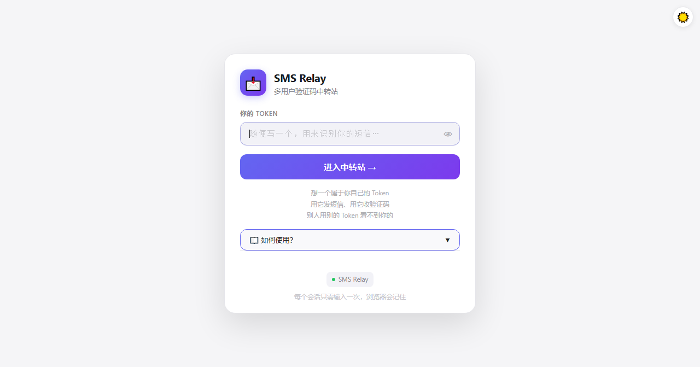
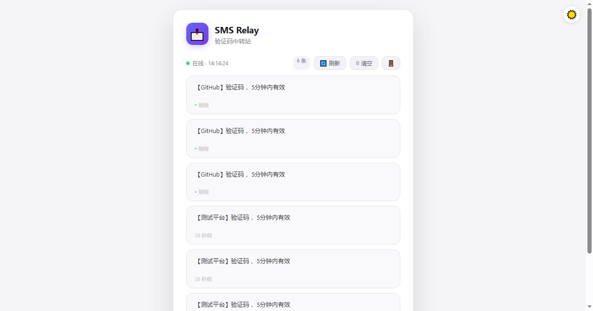

# SMS Relay 短信验证码中转

一个文件，零依赖，多用户验证码中转站。  
把手机短信转发到服务器，在浏览器里点一下就能复制验证码。

🔗 演示站：https://sms.hsfp.cn

## 功能

- 👥 **多用户隔离** — 每人一个 Token，互不干扰，无需注册
- ⚡ **零依赖** — 一个 `server.mjs` 跑起来，只靠 Node.js 自带的 http 模块
- 🔢 **自动提取验证码** — 短信里的 4-8 位数字自动高亮，点击复制
- 🌓 **暗色/亮色主题** — 右上角一键切换，偏好自动保存
- ⏰ **自动清理** — 每条消息 30 分钟后自动删除，每人最多保留 50 条
- 📖 **内置教程** — 登录页点「如何使用」查看 curl 命令和配置方法
- 💾 **纯内存** — 重启进程就清空，不留痕迹

## 截图

### 登录页



### 消息页



## 快速开始

```bash
# 默认 127.0.0.1:8787
node server.mjs

# 指定端口和地址
PORT=8787 HOST=0.0.0.0 node server.mjs
```

**没有 `TOKEN` 环境变量。** 打开网页后自己想一个 Token 就行。

## 发短信

```bash
curl -X POST https://你的域名/sms \
  -H 'X-Token: my-token' \
  -H 'Content-Type: application/json' \
  -d '{"text":"【某平台】验证码 123456，5分钟内有效"}'
```

Token 随便起，用来区分不同用户的短信。支持 JSON、纯文本、form 三种格式。

## 看短信

浏览器打开 `http://你的服务器:8787/`，输入刚才的 Token 就能看到。页面每 3 秒自动刷新，验证码点一下就能复制。

## 清空消息

```bash
curl -X DELETE https://你的域名/api/messages -H 'X-Token: my-token'
```

页面上也有「🗑 清空」按钮。

## 部署

```bash
# 放到服务器上用 Caddy / nginx 反代
PORT=8787 HOST=127.0.0.1 node server.mjs
```

建议套上 HTTPS。

## 安全提醒

- Token 只是分组标识，不是密码。但也不要用自己的重要密码当 Token
- 暴露到公网建议放反代后面
- 页面设置了 `robots: noindex, nofollow`，不会被搜索引擎收录

## 许可

MIT
